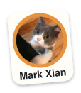

# molecare-skin-llm — a small LoRA model behind a safety harness

[](./LICENSE)
[](https://github.com/MoleCare/molecare-skin-llm/actions/workflows/ci.yml)
[](https://github.com/MoleCare/molecare-skin-llm#contributors)

> **Not a medical device.** Anything this model writes is educational. It is **not** a diagnosis. Always seek care from a qualified clinician for concerning skin changes.

> The `python-vibe` coding model that used to live here has moved to
> [YauhenBichel/python-vibe](https://github.com/YauhenBichel/python-vibe). This
> repository is skin health only.

Contributing: [CONTRIBUTING.md](./CONTRIBUTING.md) · security: [SECURITY.md](./SECURITY.md).
Vulnerabilities go to **info@molecare.co.uk**, not a public issue.

Sized for a cheap cloud box (about **700 MB RAM**), not a GPU pod.

| Name | Job | Base (4-bit) | Size | Cloud tag | Harness |
|---|---|---|---|---|---|
| `skincare-qa` | Skin-health Q&A | Llama-3.2-**1B** | ~700 MB | `llama3.2:1b` | MoleCare `skin-care-harness` |

MLX is only for **training on this Mac**. Serving is Ollama + a tiny Python sidecar. The sidecar has no weights.

```
client → harness :8080 → ollama (1B)
              ↓
     pass / revise / block
     block twice → fixed fallback
```

Same pattern as MoleCare's `skin-care-harness`: the model drafts, the harness decides
whether that draft ships. The harness is not a second model.

> **`skin-care-harness` is currently a private repository.** If you are outside MoleCare
> you cannot clone it, and the skincare rules below will not load. What that means in
> practice is set out in [Running without the harness](#running-without-the-harness).
> Making it public, or removing the dependency, is the open question. It is
> the reason [#10](https://github.com/MoleCare/molecare-skin-llm/issues/10) cannot
> be closed by anyone outside MoleCare either.

## Harnesses

| Surface | What it checks | On block |
|---|---|---|
| `/v1/skincare-qa` | MoleCare `SkinGuard` (no diagnosis, no "that's benign") | regenerate once, then the MoleCare safe fallback |

Skincare rules are **not** copied into this repository. They load from a sibling
`skin-care-harness` checkout (`packages/python`), or from
`SKIN_CARE_HARNESS_PYTHON` / `MOLECARE_ROOT`.

### Running without the harness

Without that checkout, `SkinGuard` cannot load, and the tests that exercise it
**skip rather than fail** on a contributor's machine. In CI the `safety` job runs
them against the real harness (checked out with a read token) and **fails** if it
cannot load, because `SKIN_CARE_HARNESS_REQUIRED=1` is set there.

What does and does not run from a plain clone:

| | outside MoleCare |
|---|---|
| `scripts/train.py` | **works**, from the committed splits in `data/skincare-qa/` |
| the test suite | **works**, with the safety tests skipping |
| `scripts/build_data.py` | **no** — reads the private `molecare-webapp`, then validates through the private harness |
| `scripts/serve.py` | **no** — builds a `SkincareGuard` at start-up |
| `scripts/chat.py` | **no** — same guard |

The three that do not run fail with a `FileNotFoundError` telling you to clone
`skin-care-harness`, which is an instruction you cannot follow from outside. That
is the thing to fix, not a message to work around.

Be aware of what a green run means in that case. A skipped safety test is not a
passing safety test, and this repository's central claim is that the harness stops
the model shipping a diagnosis. Treat a green CI badge here as covering everything
*except* the part that matters most, until
[#10](https://github.com/MoleCare/molecare-skin-llm/issues/10) is resolved.

## Train (Mac / MLX 3.13)

```bash
git clone https://github.com/MoleCare/molecare-skin-llm.git
cd molecare-skin-llm
/opt/homebrew/bin/python3.13 -m venv .venv
source .venv/bin/activate
pip install -r requirements.txt
PYTHONPATH=src python scripts/train.py skincare-qa
```

The splits are committed under `data/skincare-qa/`, so training starts from the
repository as cloned. There is no `build_data.py` step above on purpose:
rebuilding the data reads `molecare-webapp` and then validates the result
through `skin-care-harness`, and both are private, so that script cannot run
outside MoleCare. `molecare-ml` is image CNNs and is not used here.

## Serve (cloud or laptop)

> **What Ollama serves.** The Modelfile written by `fuse_and_export.py` points at
> the stock `llama3.2:1b` **plus the system prompt** unless you pass `--gguf`, in
> which case it points at the fused fine-tuned weights converted with llama.cpp's
> `convert_hf_to_gguf.py`. The script prints which one it wrote. Do not describe
> the default as the fine-tune.

Pull the tiny bases (you already have `llama3.2:1b`):

```bash
ollama pull qwen2.5-coder:0.5b
ollama pull llama3.2:1b
```

```bash
PYTHONPATH=src python scripts/serve.py          # 127.0.0.1:8080
PYTHONPATH=src python -m unittest discover -s tests -q
```

```bash
curl -s localhost:8080/health
curl -s localhost:8080/v1/skincare-qa \
  -H 'content-type: application/json' \
  -d '{"prompt":"What is the ABCDE rule?","red_flags":[]}'
```

Point the sidecar at a remote Ollama with `OLLAMA_HOST=http://ollama:11434`.

A 1 vCPU / 1–2 GB box is enough: Ollama holds the two 4-bit models, the harness is a few megabytes of Python.

## Chat through the harness

```bash
PYTHONPATH=src python scripts/chat.py skincare-qa "what is ABCDE?"
```

## Save big artifacts on Hugging Face

Weights do not stay only on this Mac. After fuse, push to
[YauhenBichel](https://huggingface.co/YauhenBichel):

| Local name | Hugging Face repo |
|---|---|
| `skincare-qa` | https://huggingface.co/YauhenBichel/skincare-qa-1b |

```bash
hf auth login                  # or: huggingface-cli login / export HF_TOKEN=hf_...
PYTHONPATH=src python scripts/init_hf_repos.py   # card only, creates the repo
PYTHONPATH=src python scripts/fuse_and_export.py skincare-qa --hf
# or after fuse:
PYTHONPATH=src python scripts/pull_hf.py skincare-qa
```

Repos are **private** unless you pass `--public`. The model card is written
from `cards/`. Adapters (small) use `--what adapters`; fused MLX weights are
the large folder.

## Contributors

Thank you to everyone who has helped molecare-skin-llm.

<!-- readme: contributors,bots/- -start -->
<p align="center">
  <a href="https://github.com/YauhenBichel" title="Yauhen Bichel" aria-label="Yauhen Bichel"></a>
  <a href="https://github.com/agnish-dev" title="Mondal" aria-label="Mondal"></a>
  <a href="https://github.com/xianjianlf2" title="Mark Xian" aria-label="Mark Xian"></a>
</p>
<!-- readme: contributors,bots/- -end -->

The list is filled by [Contributors](./.github/workflows/contributors.yml) from
GitHub commits, bots omitted — never hand-maintained, because a stale list is
worse than none. [Contributor graph](https://github.com/MoleCare/molecare-skin-llm/graphs/contributors) ·
[good first issue](https://github.com/MoleCare/molecare-skin-llm/labels/good%20first%20issue)
